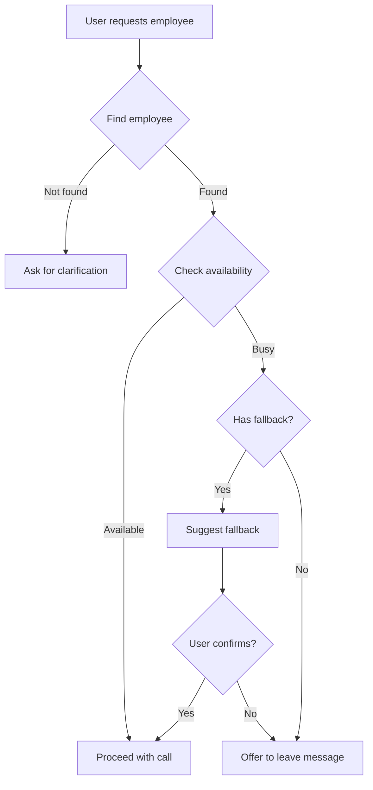

# AI Receptionist - Technical Documentation

## 📐 System Architecture

### High-Level Overview

```
┌─────────────────────────────────────────────────────────┐
│                   Browser Client                        │
│  ┌──────────────────────────────────────────────────┐  │
│  │  React Components (UI Layer)                     │  │
│  │  - Avatar (state machine visualization)          │  │
│  │  - CallUI (Teams-like interface)                 │  │
│  │  - Controls (microphone interaction)             │  │
│  │  - ConversationHistory (chat display)            │  │
│  └──────────────────────────────────────────────────┘  │
│                          ↕                              │
│  ┌──────────────────────────────────────────────────┐  │
│  │  State Management (React hooks)                  │  │
│  │  - conversationState, messages, callState        │  │
│  └──────────────────────────────────────────────────┘  │
│                          ↕                              │
│  ┌──────────────────────────────────────────────────┐  │
│  │  Media APIs                                       │  │
│  │  - MediaRecorder (audio capture)                 │  │
│  │  - Audio (playback)                              │  │
│  └──────────────────────────────────────────────────┘  │
└─────────────────────────────────────────────────────────┘
                          ↕ HTTPS
┌─────────────────────────────────────────────────────────┐
│              Next.js Server (API Routes)                │
│  ┌──────────────────────────────────────────────────┐  │
│  │  /api/speech-to-text                             │  │
│  │  → OpenAI Whisper API                            │  │
│  │  → Converts audio Blob to text                   │  │
│  └──────────────────────────────────────────────────┘  │
│  ┌──────────────────────────────────────────────────┐  │
│  │  /api/chat                                        │  │
│  │  → Google Gemini Pro API                         │  │
│  │  → Intent extraction + reasoning                 │  │
│  │  → Employee matching logic                       │  │
│  └──────────────────────────────────────────────────┘  │
│  ┌──────────────────────────────────────────────────┐  │
│  │  /api/text-to-speech                             │  │
│  │  → OpenAI TTS API                                │  │
│  │  → Converts text to audio Blob                   │  │
│  └──────────────────────────────────────────────────┘  │
│  ┌──────────────────────────────────────────────────┐  │
│  │  /api/employees                                   │  │
│  │  → Returns static employee directory             │  │
│  └──────────────────────────────────────────────────┘  │
└─────────────────────────────────────────────────────────┘
                          ↕
┌─────────────────────────────────────────────────────────┐
│              Business Logic Layer                       │
│  ┌──────────────────────────────────────────────────┐  │
│  │  lib/employees.ts                                │  │
│  │  - findEmployeeByName() - fuzzy matching        │  │
│  │  - checkAvailability() - schedule logic         │  │
│  │  - getFallbackEmployee() - routing              │  │
│  └──────────────────────────────────────────────────┘  │
└─────────────────────────────────────────────────────────┘
```

---

## 🔄 State Machine

### Conversation States

```
     ┌─────┐
     │IDLE │ ← Initial state, ready for interaction
     └──┬──┘
        │ User clicks mic
        ↓
  ┌──────────┐
  │LISTENING │ ← Recording audio via MediaRecorder
  └────┬─────┘
       │ User stops mic
       ↓
  ┌─────────┐
  │THINKING │ ← Processing: STT → Gemini → TTS
  └────┬────┘
       │ AI ready to speak
       ↓
  ┌─────────┐
  │SPEAKING │ ← Playing TTS audio
  └────┬────┘
       │ Audio ends OR call initiated
       ↓
  ┌────────┐
  │CALLING │ ← Teams-like call UI active
  └────┬───┘
       │ User ends call
       ↓
     ┌─────┐
     │IDLE │
     └─────┘
```

### State Transitions

| From | Event | To | Side Effects |
|------|-------|-----|--------------|
| IDLE | Click mic | LISTENING | Start MediaRecorder |
| LISTENING | Click mic again | THINKING | Stop recorder, start processing |
| THINKING | AI response ready | SPEAKING | Play TTS audio |
| SPEAKING | Audio ends | IDLE | Update conversation history |
| SPEAKING | Call confirmed | CALLING | Show countdown, then call UI |
| CALLING | End call button | IDLE | Close call UI |

---

## 🧩 Component Architecture

### Component Tree

```
App (page.tsx)
├── Avatar
│   ├── State indicator (color-coded)
│   ├── Pulse animations
│   └── Speaking sound waves
├── Controls
│   ├── Microphone button
│   └── Status text
├── ConversationHistory
│   └── Message bubbles (user/assistant)
├── CallUI (conditional)
│   ├── Top bar (status)
│   ├── Employee avatar
│   ├── Employee info
│   └── Control buttons (mute, end)
└── Notification (conditional)
    └── Toast message
```

### Component Props Flow

```typescript
// Parent state (page.tsx)
const [conversationState, setConversationState] = useState<ConversationState>('idle');
const [messages, setMessages] = useState<Message[]>([]);
const [isCallActive, setIsCallActive] = useState(false);
const [currentEmployee, setCurrentEmployee] = useState<Employee | null>(null);

// Props to children
<Avatar state={conversationState} isThinking={isProcessing} />
<Controls onStartListening={...} onStopListening={...} />
<CallUI isActive={isCallActive} employee={currentEmployee} onEndCall={...} />
<ConversationHistory messages={messages} />
```

---

## 🔐 API Integration

### 1. Speech-to-Text (Whisper)

**Endpoint**: `POST /api/speech-to-text`

**Request**:
```typescript
FormData {
  audio: Blob // audio/webm format
}
```

**Response**:
```typescript
{
  text: string,        // Transcribed text
  success: boolean
}
```

**Implementation**:
```typescript
const transcription = await openai.audio.transcriptions.create({
  file: audioFile,
  model: 'whisper-1',
  language: 'en',
});
```

---

### 2. AI Chat (Gemini)

**Endpoint**: `POST /api/chat`

**Request**:
```typescript
{
  message: string,
  conversationHistory: Message[]
}
```

**Response**:
```typescript
{
  intent: 'make_call' | 'ask_question' | 'leave_message' | 'unknown',
  employee?: string,           // Extracted employee name
  department?: string,         // Extracted department
  confidence: number,          // 0.0 - 1.0
  response: string,            // What AI says to user
  employeeId?: string,         // If employee found
  fallbackEmployee?: string,   // Alternative employee name
  fallbackEmployeeId?: string, // Alternative employee ID
  requiresConfirmation?: boolean,
  canProceedWithCall?: boolean
}
```

**Prompt Strategy**:
```typescript
const systemPrompt = `You are an AI receptionist.
Rules:
- Be polite and professional
- Keep responses concise (1-2 sentences)
- Always confirm before taking action

Respond in JSON format:
{
  "intent": "...",
  "employee": "...",
  "response": "..."
}`;
```

---

### 3. Text-to-Speech (OpenAI TTS)

**Endpoint**: `POST /api/text-to-speech`

**Request**:
```typescript
{
  text: string
}
```

**Response**:
```
Content-Type: audio/mpeg
Body: audio Blob
```

**Implementation**:
```typescript
const mp3 = await openai.audio.speech.create({
  model: 'tts-1',
  voice: 'nova',    // Professional female voice
  input: text,
  speed: 0.95,      // Slightly slower for clarity
});
```

**Voice Selection**:
- `nova`: Professional, calm female voice (chosen)
- `alloy`: Neutral, versatile
- `echo`: Male, clear
- `fable`: Expressive, British accent
- `onyx`: Deep male voice
- `shimmer`: Warm female voice

---

## 📊 Data Models

### Employee

```typescript
interface Employee {
  id: string;              // Unique identifier
  name: string;            // Full name
  department: string;      // Engineering, Product, Design, etc.
  title: string;          // Job title
  email: string;          // Contact email
  avatar?: string;        // Profile picture URL (optional)
  isAvailable: boolean;   // Current availability
  meetings: Meeting[];    // Today's schedule
  fallbackEmployee?: string; // ID of backup person
}
```

### Meeting

```typescript
interface Meeting {
  start: string;  // "09:00"
  end: string;    // "10:30"
  title: string;  // "Sprint Planning"
}
```

### Message

```typescript
interface Message {
  role: 'user' | 'assistant';
  content: string;
  timestamp: Date;
}
```

---

## 🧠 Business Logic

### Employee Matching Algorithm

```typescript
function findEmployeeByName(name: string): Employee | null {
  const searchName = name.toLowerCase().trim();
  
  // 1. Exact match (highest priority)
  let employee = EMPLOYEES.find(emp => 
    emp.name.toLowerCase() === searchName
  );
  if (employee) return employee;
  
  // 2. First name match
  employee = EMPLOYEES.find(emp => 
    emp.name.toLowerCase().split(' ')[0] === searchName
  );
  if (employee) return employee;
  
  // 3. Partial match (fuzzy)
  employee = EMPLOYEES.find(emp => 
    emp.name.toLowerCase().includes(searchName)
  );
  return employee || null;
}
```

### Availability Check

```typescript
function checkAvailability(employee: Employee): {
  isAvailable: boolean;
  reason?: string;
  nextAvailable?: string;
} {
  const now = new Date();
  const currentTime = now.getHours() * 60 + now.getMinutes();
  
  // Check if current time overlaps with any meeting
  for (const meeting of employee.meetings) {
    const [startHour, startMin] = meeting.start.split(':').map(Number);
    const [endHour, endMin] = meeting.end.split(':').map(Number);
    
    const startTime = startHour * 60 + startMin;
    const endTime = endHour * 60 + endMin;
    
    if (currentTime >= startTime && currentTime < endTime) {
      return {
        isAvailable: false,
        reason: meeting.title,
        nextAvailable: meeting.end
      };
    }
  }
  
  return { isAvailable: employee.isAvailable };
}
```

### Smart Routing Logic



---

## 🎨 UI/UX Design Principles

### 1. Visual Feedback
- **Every action has immediate visual response**
- State changes are animated (Framer Motion)
- Color coding for clarity (blue=listening, yellow=thinking, green=speaking)

### 2. Progressive Disclosure
- Start simple (just avatar + mic button)
- Show more as needed (conversation history, call UI)
- Hide complexity (API calls, state management)

### 3. Error Recovery
- Never crash or show blank screen
- Always provide fallback message
- Graceful degradation if API fails

### 4. Professional Polish
- Microsoft Teams aesthetic (familiar to enterprise users)
- Smooth animations (60fps)
- Consistent spacing and typography
- Professional voice (Nova at 0.95x speed)

---

## ⚡ Performance Optimizations

### 1. Audio Processing
- Stream audio in chunks (not all at once)
- Use Web Audio API (native browser support)
- Release MediaStream after recording

### 2. API Calls
- Parallel processing where possible
- Abort controllers for cancellation
- Retry logic with exponential backoff

### 3. State Management
- Simple React state (avoid Redux overhead)
- Minimal re-renders (proper memoization)
- Cleanup on unmount

### 4. Bundle Size
- Tree-shaking with Next.js
- Dynamic imports for heavy components
- Optimize images and assets

---

## 🔒 Security Considerations

### Current Demo (No Security)
- API keys in environment variables (server-side only)
- No authentication required
- No data persistence
- No rate limiting

### Production Requirements
```typescript
// TODO for production:
- User authentication (OAuth, SSO)
- API rate limiting (per user)
- CORS configuration
- CSP headers
- Input sanitization
- XSS prevention
- Audit logging
- Data encryption at rest
- GDPR compliance (consent, data deletion)
- HIPAA compliance (if healthcare data)
```

---

## 📈 Scalability

### Current Bottlenecks
1. **API rate limits**: Gemini (60 req/min), OpenAI (3500 req/min)
2. **Stateless**: No session persistence
3. **Single instance**: No load balancing

### Scale to 1000+ Users
```typescript
// Architecture changes needed:
1. Add Redis for session state
2. Implement queue (BullMQ) for API calls
3. WebSocket for real-time updates
4. CDN for static assets
5. Database for conversation history
6. Horizontal scaling (multiple server instances)
7. API gateway for rate limiting
```

---

## 🧪 Testing Strategy

### Unit Tests
```typescript
// lib/employees.test.ts
test('finds employee by first name', () => {
  const result = findEmployeeByName('Rahul');
  expect(result?.name).toBe('Rahul Kumar');
});

test('checks availability during meeting', () => {
  const employee = EMPLOYEES[0];
  const result = checkAvailability(employee);
  expect(result.isAvailable).toBe(false);
});
```

### Integration Tests
```typescript
// api/chat.test.ts
test('extracts intent from user message', async () => {
  const response = await fetch('/api/chat', {
    method: 'POST',
    body: JSON.stringify({
      message: 'I want to talk to Rahul',
      conversationHistory: []
    })
  });
  const data = await response.json();
  expect(data.intent).toBe('make_call');
  expect(data.employee).toContain('Rahul');
});
```

### E2E Tests (Playwright)
```typescript
test('complete user journey', async ({ page }) => {
  await page.goto('http://localhost:3000');
  await page.click('[data-testid="mic-button"]');
  // Simulate audio input
  await page.click('[data-testid="mic-button"]');
  await expect(page.locator('.conversation-history')).toContainText('Rahul');
});
```

---

## 📚 Further Reading

- [Next.js App Router](https://nextjs.org/docs/app)
- [OpenAI API Reference](https://platform.openai.com/docs/api-reference)
- [Google Gemini Docs](https://ai.google.dev/docs)
- [Web Audio API](https://developer.mozilla.org/en-US/docs/Web/API/Web_Audio_API)
- [Framer Motion](https://www.framer.com/motion/)

---

**Built with ❤️ for demonstrating modern AI capabilities**
